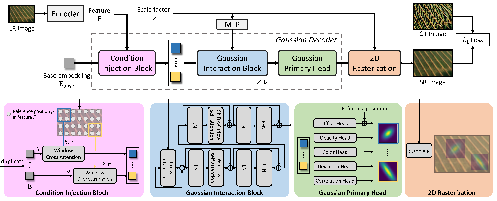
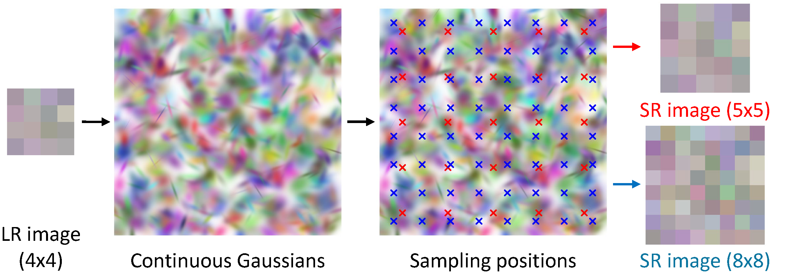
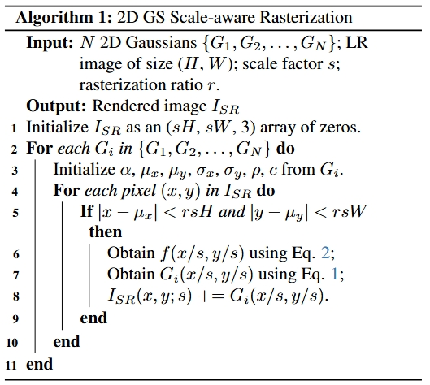

# GSASR
Official PyTorch code for our Paper "Generalized and Efficient 2D Gaussian Splatting for
Arbitrary-scale Super-Resolution"

### [Paper and Supplementary (Arxiv Version)](https://arxiv.org/pdf/2501.06838)

> **Generalized and Efficient 2D Gaussian Splatting for
Arbitrary-scale Super-Resolution** <br>
> [Du CHEN\*](https://github.com/ChrisDud0257), [Liyi CHEN\*](https://github.com/mt-cly), [Zhengqiang ZHANG](https://github.com/xtudbxk) and [Lei ZHANG](https://www4.comp.polyu.edu.hk/~cslzhang/). <br>


# 1.Introduction about GSASR

## Abstract
Equipped with the continuous representation capability of Multi-Layer Perceptron (MLP), Implicit Neural Representation (INR) has been successfully employed for Arbitrary-scale Super-Resolution (ASR). 
However, the limited receptive field of the linear layers in MLP restricts the representation capability of INR, while it is computationally expensive to query the MLP numerous times to render each pixel. 
Recently, Gaussian Splatting (GS) has shown its advantages over INR in both visual quality and rendering speed in 3D tasks, which motivates us to explore whether GS can be employed for the ASR task. 
However, directly applying GS to ASR is exceptionally challenging because the original GS is an optimization-based method through overfitting each single scene, while in ASR we aim to learn a single model 
that can generalize to different images and scaling factors. We overcome these challenges by developing two novel techniques. Firstly, to generalize GS for ASR, we elaborately design an architecture to 
predict the corresponding image-conditioned Gaussians of the input low-resolution image in a feed-forward manner. Secondly, we implement an efficient differentiable ___2D GPU/CUDA-based___ scale-aware rasterization 
to render super-resolved images by sampling discrete RGB values from the predicted contiguous Gaussians. Via end-to-end training, our optimized network, namely GSASR, can perform ASR for any image and unseen 
scaling factors. Extensive experiments validate the effectiveness of our proposed method. 

## Framework

In the training phase, an LR image is fed into the encoder to extract image features, conditioned on which the learnable Gaussian embeddings are passed through the Condition Injection Block and Gaussian
Interaction Block to output 2D Gaussians. These 2D Gaussians are then rendered into an SR image of a specified resolution through differential rasterization.


## Fast Rasterization

Simply rendering an SR image by querying each pixel from all 2D Gaussians leads to a complexity of ___O(s<sup>2</sup>HWN)___, which is too high for high-resolution images.
Actually, a Gaussian generally focuses on a limited area and its contribution to pixel values decays rapidly with the increase of distance.
Therefore, we introduce a rasterization ratio ___r<1___ to control the rendering range of each Gaussian.
Specifically, we handle all Gaussians in parallel and only render the pixels that are close enough to the Gaussian centers, greatly reducing the computational complexity to ___O(r<sup>2</sup>s<sup>2</sup>HWN)___ and 
making our algorithm practical. (___r___ is set to ___0.1___ in our implementation.)
Note that our rasterization process is differential, which can be seamlessly integrated with neural networks for end-to-end optimization. This algorithm is implemented via ___CUDA C++___, which is GPU-friendly and 
achieves faster speed and low memory requirements.


The algorithm is described as follows,




# 2.Quick Inference


# 3.Training and Testing Code


# 4.License
This project is released under the Apache 2.0 license.

# 5.Citation
If you find this research helpful for you, please follow us by
```bash
@article{chen2025generalized,
  title={Generalized and Efficient 2D Gaussian Splatting for Arbitrary-scale Super-Resolution},
  author={Chen, Du and Chen, Liyi and Zhang, Zhengqiang and Zhang, Lei},
  journal={arXiv preprint arXiv:2501.06838},
  year={2025}
}
```
